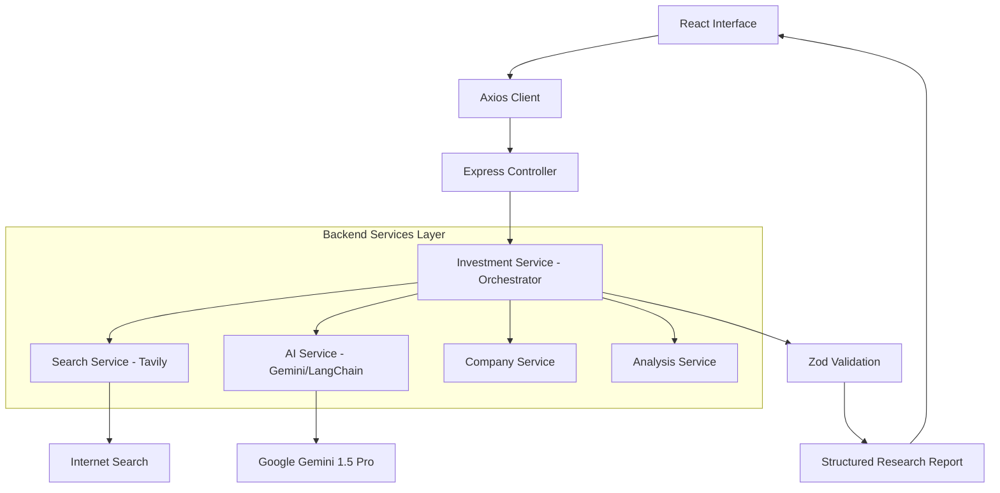

# AI Investment Research Agent 🚀

A professional-grade, multi-agent AI application designed to provide comprehensive investment research on public companies. Powered by Google Gemini (via LangChain.js) and Tavily Search API.

---

## 🏗 Architecture Diagram



---

## ✨ Features

- **Deep Research**: Real-time web search for the latest company news and financials.
- **AI Analysis**: High-level synthesis using Google Gemini to act as a Senior Investment Analyst.
- **Investment Recommendation**: INVEST, PASS, or WATCH with confidence scores.
- **SWOT & Financials**: Structured analysis of strengths, weaknesses, and key metrics.
- **Search History**: Persisted locally for quick access.
- **Modern UI**: Dark-themed dashboard with Glassmorphism and responsive design.
- **Production Ready**: Granular services, middleware, Zod validation, and professional logging.

---

## 🛠 Tech Stack

- **Frontend**: React (Vite), Tailwind CSS, Framer Motion, Axios, Lucide Icons.
- **Backend**: Node.js, Express.js, Pino Logger, Zod.
- **AI/Search**: LangChain.js, Google Gemini API, Tavily Search API.

---

## 📁 Folder Structure

```
AI-Investment-Agent/
├── backend/
│   ├── src/
│   │   ├── config/       # API Configurations
│   │   ├── controllers/  # Request handlers
│   │   ├── middleware/   # validation, errors, async
│   │   ├── prompts/      # AI Prompt Templates
│   │   ├── routes/       # API Endpoints
│   │   ├── schemas/      # Zod validation schemas
│   │   ├── services/     # Granular business logic
│   │   ├── utils/        # Logger, formatters
│   │   ├── app.js
│   │   └── server.js
│   ├── package.json
│   └── .env.example
├── frontend/
│   ├── src/
│   │   ├── components/   # layout, search, cards, common
│   │   ├── context/      # Global state (AnalysisContext)
│   │   ├── hooks/        # useAnalysis, useLocalStorage
│   │   ├── services/     # API interaction
│   │   ├── pages/        # Home dashboard
│   │   ├── constants/    # Theme & API constants
│   │   └── App.jsx
│   ├── package.json
│   └── vite.config.js
├── README.md
└── package.json
```

---

## 🚀 Getting Started

### 1. Prerequisites
- Node.js (v18+)
- Gemini API Key ([Get it here](https://aistudio.google.com/))
- Tavily API Key ([Get it here](https://tavily.com/))

### 2. Installation
```bash
# Install root dependencies
npm install

# Install backend & frontend dependencies
npm run install:all
```

### 3. Environment Setup
Create a `.env` file in the `backend/` directory:
```env
PORT=5000
GEMINI_API_KEY=your_gemini_api_key
TAVILY_API_KEY=your_tavily_api_key
NODE_ENV=development
```

### 4. Running the Application
```bash
# Run both frontend and backend concurrently
npm run dev
```

---

## 📝 API Documentation

### POST `/api/analyze`
Starts a company research and analysis workflow.

**Request Body:**
```json
{
  "company": "NVIDIA"
}
```

**Response Format:**
```json
{
  "success": true,
  "timestamp": "2026-06-27T10:20:00Z",
  "processingTime": "12.4s",
  "data": {
    "company": "NVIDIA",
    "overview": "...",
    "recommendation": "INVEST",
    "confidence": 92,
    "financialAnalysis": { ... },
    "swot": { ... },
    "latestNews": [ ... ],
    "reasoning": "...",
    "sources": [ ... ]
  }
}
```

---

## 🔮 Future Improvements
- [ ] Export report as PDF.
- [ ] Comparison tool (Analyze 2 companies side-by-side).
- [ ] Stock price charts using Recharts.
- [ ] Email notifications for company updates.

---

## Vercel Live link:
https://ai-investment-agent-ltd9.vercel.app/
